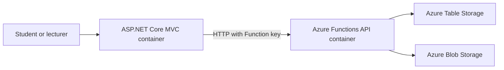

# 💬 ProfDrop

> **Say it anonymously. Make learning better.**

ProfDrop is a full-stack web application that lets students share anonymous course feedback during the semester. Lecturers can sign in to review feedback linked to their courses.

## Table of contents

- [Group members](#-group-members)
- [About the project](#-about-the-project)
- [The problem and research basis](#-the-problem-and-research-basis)
- [Our solution](#-our-solution)
- [Target users and features](#-target-users-and-features)
- [Requirements](#-requirements)
- [Technology stack](#-technology-stack)
- [System architecture](#-system-architecture)
- [Data storage](#-data-storage)
- [Running the project locally](#-running-the-project-locally)
- [API testing](#-api-testing)
- [Docker Compose](#-docker-compose)
- [CI/CD](#-cicd)
- [Deployment](#-deployment)
- [Future improvements](#-future-improvements)

## 👩‍💻 Group members

| Member | Main contributions |
|---|---|
| **Hameeda Hamid** | Student feedback flow, backend/API work, Table Storage setup, testing and DevOps contribution |
| **Khadija** | Lecturer flow, authentication, Blob Storage setup, testing and DevOps contribution |


## 🌱 About the project

Students can submit feedback without creating an account. Lecturers use a protected dashboard to view their assigned courses and read course feedback.

The solution uses an ASP.NET Core MVC frontend, a .NET isolated Azure Functions API, Azure Storage, Docker Compose and GitHub Actions.

## ❗ The problem and research basis

In our target setting, Student Evaluation of Teaching surveys are available during set periods. Students may want to comment on a class while the experience is fresh, and lecturers may not see useful feedback until later.

Research supports using feedback to guide improvements, while also cautioning that student evaluation scores alone may not represent student learning. ProfDrop is designed as a channel for timely, course-level comments that complements existing evaluations. It is not a standalone measure of teaching effectiveness.

## 💡 Our solution

Students choose a course, view the linked lecturer, select a category and submit a message anonymously. Lecturers sign in, view their own courses and filter course feedback by category.

## 👥 Target users and features

| User | Features |
|---|---|
| **Students** | View available courses and lecturer details, submit anonymous categorized feedback, and receive a confirmation after submission. |
| **Lecturers** | Sign in, view assigned courses, review feedback and filter entries by category. |

## ✅ Requirements

### Functional requirements

1. Students can submit anonymous feedback for a selected course and category.
2. Lecturers can sign in and see the courses assigned to their account.
3. Lecturers can review feedback for their courses and filter it by category.

### Non-functional requirements

1. **Privacy and security:** Feedback records do not contain a student's name, email address or ID. Lecturer pages and course feedback require access checks.
2. **Data persistence:** Course, lecturer and feedback records are stored in Azure Table Storage. Lecturer profile images are stored in Azure Blob Storage.
3. **Usability:** The student feedback flow is short and the lecturer dashboard presents courses and feedback clearly.

## 🛠️ Technology stack

| Area | Technology |
|---|---|
| Frontend | ASP.NET Core MVC with Razor views |
| Backend | .NET 10 Azure Functions, isolated worker, HTTP triggers |
| Structured data | Azure Table Storage |
| Lecturer images | Azure Blob Storage |
| Local container orchestration | Docker Compose |
| API collection | Postman |
| Automated API checks | Newman |
| CI and security analysis | GitHub Actions and CodeQL |
| Version control | Git and GitHub |

Docker Compose connects the API container to the Azure Storage account using a connection string from the local `.env` file. The GitHub Actions test job uses Azurite for its test storage.

## 🏗️ System architecture



Docker Compose starts the MVC and Functions containers. Azure Storage remains hosted in Azure and is configured through environment variables. The MVC container calls the API at `http://api/api/` using the Compose service name. The browser reaches the MVC app at `http://localhost:7216`.

## 🗃️ Data storage

ProfDrop uses Azure Table Storage for structured application data.

### Lecturers table

- Partition key: `LECTURER`
- Row key: lecturer email
- Stores the lecturer name, email, password hash and profile image URL

### Courses table

- Partition key: `COURSE`
- Row key: course code
- Stores the course name and linked lecturer email

### Feedback table

- Partition key: `FEEDBACK`
- Row key: unique feedback ID
- Stores the category, message and submission date
- Does not store student identity

Lecturer profile images are stored in the `lecturer-images` Azure Blob Storage container. The lecturer record stores the image URL.

## 💻 Running the project locally

### Prerequisites

- Git
- Docker Desktop
- A valid Azure Storage connection string with the required Table and Blob services
- A local Azure Functions key for the API

### 1. Get the repository

Clone the repository and enter its root folder:

```powershell
git clone https://github.com/hameedahamid/ProfDrop.git
cd ProfDrop
```

### 2. Open the solution

Open `ProfDrop.slnx` in Visual Studio. The solution contains the MVC and Functions projects.

### 3. Configure local values

In the project root, copy `.env.example` to `.env` if you do not already have a local `.env`. Fill in your own values:

```env
AZURE_STORAGE_CONNECTION_STRING=your_azure_storage_connection_string
PROFDROP_FUNCTION_KEY=your_function_key
```

The Function key must match the key configured in the local file-based Functions secret store. Docker Compose mounts the `function-secrets/` folder into the API container. Make sure `.gitignore` includes `.env`, `function-secrets/` and `local.settings.json` so local keys and connection strings stay out of Git. Do not replace a working local `.env` with the example file.

If you run the Functions project directly outside Docker, use `local.settings.json` for its local app settings. That file is separate from the Compose `.env` file.

### 4. Start Docker Desktop

Open Docker Desktop and wait until it reports that Docker is running.

### 5. Start the application

Open a terminal in the project root, beside `docker-compose.yml`, and run:

```powershell
docker compose up --build
```

The first build can take a few minutes. When it is ready, open:

- Website: [http://localhost:7216](http://localhost:7216)
- Functions API: [http://localhost:7293](http://localhost:7293)

The API uses Function-level authorization. The MVC app sends the configured key in the `x-functions-key` header.

### 6. Stop and restart

Press **Ctrl+C** in the terminal, then run:

```powershell
docker compose down
```

To start it again without rebuilding, run `docker compose up`. Use `docker compose up --build` after changing code or Docker configuration.

## 🧪 API testing

The Postman collection is stored at:

```text
Postman/ProfDrop.postman_collection.json
```

The collection covers course retrieval, feedback submission and validation, lecturer login, lecturer course lists and access to course feedback.

Install Newman once with `npm install --global newman`. The collection's default `baseUrl` is `http://localhost:7293/api`. Run it while the Functions API is available:

```powershell
newman run Postman/ProfDrop.postman_collection.json --working-dir Postman
```

For direct requests to the Function-authorized API, provide the local Function key in the `x-functions-key` header. The CI workflow starts Azurite and the local Functions host before it runs the collection.

The collection runs in CI against the local Functions Core Tools host. When you call the containerized API directly from Postman, add the local Function key as an `x-functions-key` header. Do not save a real key in the shared collection.

## 🐳 Docker Compose

The root `docker-compose.yml` defines two services:

| Service | Container | Host port |
|---|---|---:|
| `web` | ASP.NET Core MVC | 7216 |
| `api` | Azure Functions | 7293 |

The Dockerfiles are `ProfDropMVC/Dockerfile` and `ProfDropFunctions/Dockerfile`. The API container connects to Azure Storage using `AZURE_STORAGE_CONNECTION_STRING`; there is no Azurite service in the Compose stack.

The Compose file reads `AZURE_STORAGE_CONNECTION_STRING` and `PROFDROP_FUNCTION_KEY` from the root `.env` file. Commit `.env.example` with placeholder values, but never commit the real `.env` file or local Functions keys.

## ⚙️ CI/CD

The `.github/workflows/ci.yml` workflow is configured to run on pushes to `main`, pull requests targeting `main`, and manual runs. It restores and builds `ProfDrop.slnx`, starts Azurite and the local Functions API for the Postman collection, then runs `docker compose build` to check that both images build.

The separate `.github/workflows/codeql.yml` workflow performs CodeQL security analysis.

These workflows provide build, test and container-build checks. Automated deployment from GitHub Actions still needs to be configured.

## ☁️ Deployment

**Live URL:** Not deployed yet

**Target platform:** Azure

## 🚀 Future improvements

- Notify lecturers when new feedback arrives.
- Let students link feedback to a specific class session.
- Show category trends over time.
- Let lecturers mark feedback as reviewed or actioned.
- Provide anonymous high-level reports.

## 💚 ProfDrop

**Say it anonymously. Make learning better.**

